Actualizado al commit 7326a5a (03/10/2026)

# 09 — Diagramas (generados desde el código real)

> Sintaxis Mermaid revisada a mano (no hay `mermaid-cli` instalado y no se agregaron dependencias): se evitaron punto y coma, llaves y la palabra reservada `end` dentro de etiquetas. Cada diagrama indica los archivos de origen.

---

## 1. ERD (modelos Django)

Fuente: `backend/*/models.py`. Se muestran PK, FK, UK y los campos principales; se omiten los campos técnicos de Django en `Usuario` (`is_staff`, `is_superuser`, `last_login`, grupos y permisos).

```mermaid
erDiagram
    Usuario {
        uuid id PK
        string nombre_completo
        string username UK
        string password_hash
        string rol "ADMIN u OPERADOR"
        bool activo
        datetime fecha_creacion
    }
    Dispositivo {
        uuid id PK
        uuid identificador UK
        string nombre UK
        bool es_caja
        bool autorizado_offline "solo uno en true"
        bool activo
        uuid registrado_por_id FK
        datetime fecha_registro
        datetime ultima_sincronizacion
    }
    ConfiguracionModulo {
        uuid id PK "fila unica"
        bool ventas_activo
        bool inventario_activo
        bool servicios_activo
        bool finanzas_activo
        uuid actualizado_por_id FK "nullable"
        datetime actualizado_en
    }
    ConfiguracionPago {
        uuid id PK "fila unica"
        bool acepta_efectivo
        bool acepta_transferencia
        bool acepta_qr
        string nequi_titular
        string nequi_llave
        uuid actualizado_por_id FK
        datetime actualizado_en
    }
    OperacionSincronizacion {
        uuid id PK
        uuid operation_id UK
        uuid dispositivo_id FK "nullable"
        uuid usuario_id FK
        string recurso
        string accion
        string estado
        string origen
        string codigo_conflicto
        string mensaje
        uuid objeto_id
        json payload
        int status_code_original
        datetime fecha_cliente
        datetime fecha_procesamiento
        bool atendida
    }
    Categoria {
        uuid id PK
        uuid operation_id UK
        string nombre UK
    }
    Producto {
        uuid id PK
        uuid operation_id UK
        uuid categoria_id FK
        string nombre
        string tipo
        decimal precio_venta
        decimal costo_produccion
        decimal stock_actual
        decimal stock_minimo
        bool controla_stock
        string unidad_medida
        bool activo
    }
    MovimientoInventario {
        uuid id PK
        uuid operation_id UK
        uuid producto_id FK
        uuid usuario_id FK
        uuid venta_id FK "nullable"
        uuid consumo_orden_id FK "nullable unico"
        string tipo
        decimal cantidad
        string sentido
        datetime fecha
        string motivo
    }
    Mesa {
        uuid id PK
        uuid operation_id UK
        int numero UK "1 a 15"
        bool activa
        string estado
    }
    Venta {
        uuid id PK
        uuid operation_id UK
        string tipo
        uuid usuario_id FK
        uuid mesa_id FK "nullable"
        string estado
        datetime fecha_apertura
        datetime fecha_cierre
        string medio_pago
        string estado_pago
        decimal total
    }
    DetalleVenta {
        uuid id PK
        uuid operation_id UK
        uuid venta_id FK
        uuid producto_id FK
        decimal cantidad
        decimal precio_unitario
        decimal subtotal
    }
    OrdenTrabajo {
        uuid id PK
        uuid operation_id UK
        uuid usuario_id FK
        string cliente_nombre
        string cliente_telefono
        text descripcion
        datetime fecha_solicitud
        date fecha_entrega_estimada
        string estado
        decimal costo_total
        decimal saldo_pendiente
        decimal utilidad_neta
    }
    Abono {
        uuid id PK
        uuid operation_id UK
        uuid orden_id FK
        uuid usuario_id FK
        decimal valor
        string medio_pago
        string estado_pago
        datetime fecha
        string observacion
    }
    ConsumoOrden {
        uuid id PK
        uuid operation_id UK
        uuid orden_id FK
        uuid producto_id FK
        decimal cantidad
        string estado
        datetime fecha_registro
    }
    CostoOperativoOrden {
        uuid id PK
        uuid operation_id UK
        uuid orden_id FK
        string concepto
        decimal valor
    }
    MovimientoCaja {
        uuid id PK
        uuid operation_id UK
        uuid usuario_id FK
        uuid venta_id FK "nullable unico"
        uuid abono_id FK "nullable unico"
        uuid cierre_caja_id FK "nullable"
        string tipo
        string medio_pago
        string estado_pago
        decimal valor
        string concepto
        datetime fecha
        datetime fecha_confirmacion
        string motivo_anulacion
    }
    CierreCaja {
        uuid id PK
        uuid operation_id UK
        uuid usuario_id FK
        date fecha UK
        datetime periodo_inicio
        datetime periodo_fin
        decimal total_ingresos_ventas
        decimal total_ingresos_abonos
        decimal total_gastos
        decimal total_neto
        decimal efectivo_esperado
        decimal efectivo_contado
        decimal diferencia
        text observaciones
        datetime fecha_creacion
    }

    Usuario ||--o{ Dispositivo : "registra"
    Usuario |o--o{ ConfiguracionModulo : "actualiza"
    Usuario ||--o{ ConfiguracionPago : "actualiza"
    Usuario ||--o{ OperacionSincronizacion : "origina"
    Dispositivo |o--o{ OperacionSincronizacion : "envia"
    Categoria ||--o{ Producto : "agrupa"
    Producto ||--o{ MovimientoInventario : "afecta"
    Usuario ||--o{ MovimientoInventario : "registra"
    Venta |o--o{ MovimientoInventario : "SALIDA_VENTA"
    ConsumoOrden |o--o| MovimientoInventario : "SALIDA_SERVICIO"
    Mesa |o--o{ Venta : "aloja sesiones"
    Usuario ||--o{ Venta : "atiende"
    Venta ||--o{ DetalleVenta : "contiene"
    Producto ||--o{ DetalleVenta : "vendido en"
    Usuario ||--o{ OrdenTrabajo : "registra"
    OrdenTrabajo ||--o{ Abono : "recibe"
    Usuario ||--o{ Abono : "registra"
    OrdenTrabajo ||--o{ ConsumoOrden : "usa"
    Producto ||--o{ ConsumoOrden : "consumido en"
    OrdenTrabajo ||--o{ CostoOperativoOrden : "tiene"
    Usuario ||--o{ MovimientoCaja : "registra"
    Venta |o--o| MovimientoCaja : "INGRESO_VENTA"
    Abono |o--o| MovimientoCaja : "INGRESO_ABONO"
    CierreCaja |o--o{ MovimientoCaja : "consolida"
    Usuario ||--o{ CierreCaja : "realiza"
```

---

## 2. Despliegue

Fuente: `Dockerfile`, `render.yaml`, `backend/core/settings.py`, `frontend/vite.config.ts`.

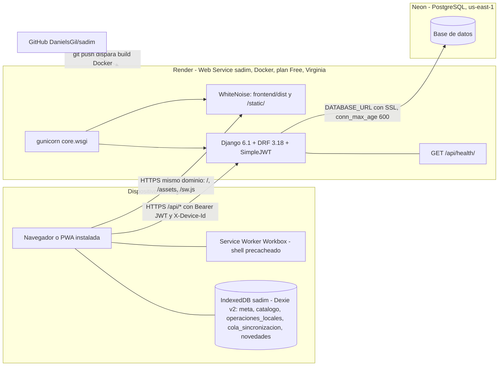

Sin cambios de estructura desde el 02/10. Desde B1 (`e57e7a6`), el servicio no arranca si falta `SECRET_KEY` con `DEBUG=False`; desde B2 (`fc6c598`), el service worker deja pasar `/api/` y `/admin/` al servidor.

---

## 3. Módulos del backend y relación con el frontend

Fuente: `backend/core/urls.py`, `*/urls.py`, `frontend/src/api/*`, `frontend/src/sync/*`.

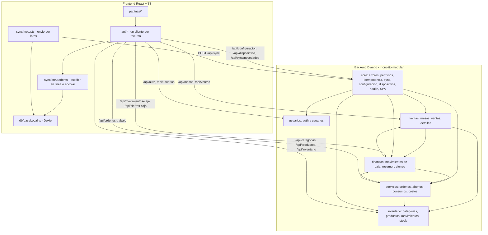

Banderas: `ventas_activo` (VEN), `inventario_activo` (movimientos y stock de INV), `servicios_activo` (SER), `finanzas_activo` (FIN). Catálogo, usuarios, configuración, dispositivos y sync no dependen de bandera.

---

## 4. Secuencia de sincronización offline

Fuente: `frontend/src/sync/enrutador.ts`, `motor.ts`, `almacenDexie.ts`, `reconciliacion.ts`, `frontend/src/api/ventas.ts`, `backend/core/sync.py`, `core/idempotencia.py`.

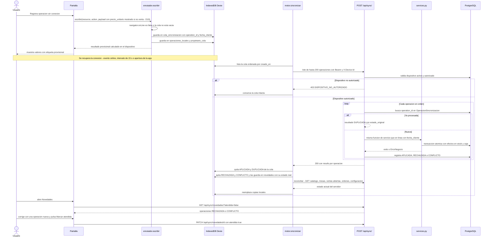

---

## 5. Secuencia de venta rápida (en línea)

Fuente: `frontend/src/componentes/FormularioVentaRapida.tsx`, `BandejaSeleccion.tsx`, `frontend/src/api/ventas.ts`, `backend/ventas/views.py:94-125`, `ventas/services.py:150-217`, `inventario/services.py:162-181`.

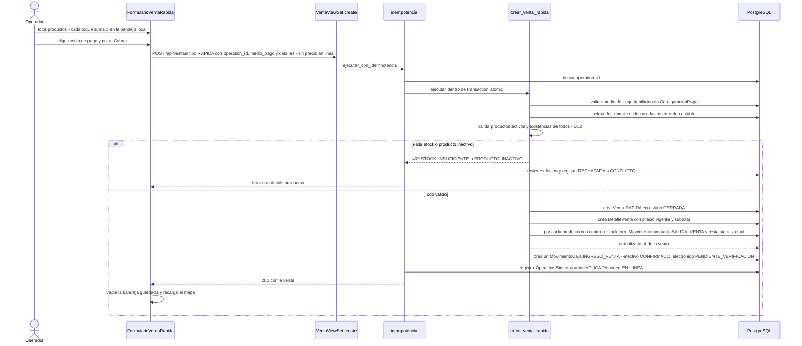

---

## 6. Secuencia de cuenta de mesa (sesión dinámica) hasta el cobro

Fuente: `frontend/src/paginas/DetalleSesion.tsx:191-291` (D26, E-12), `backend/ventas/services.py:220-399`.

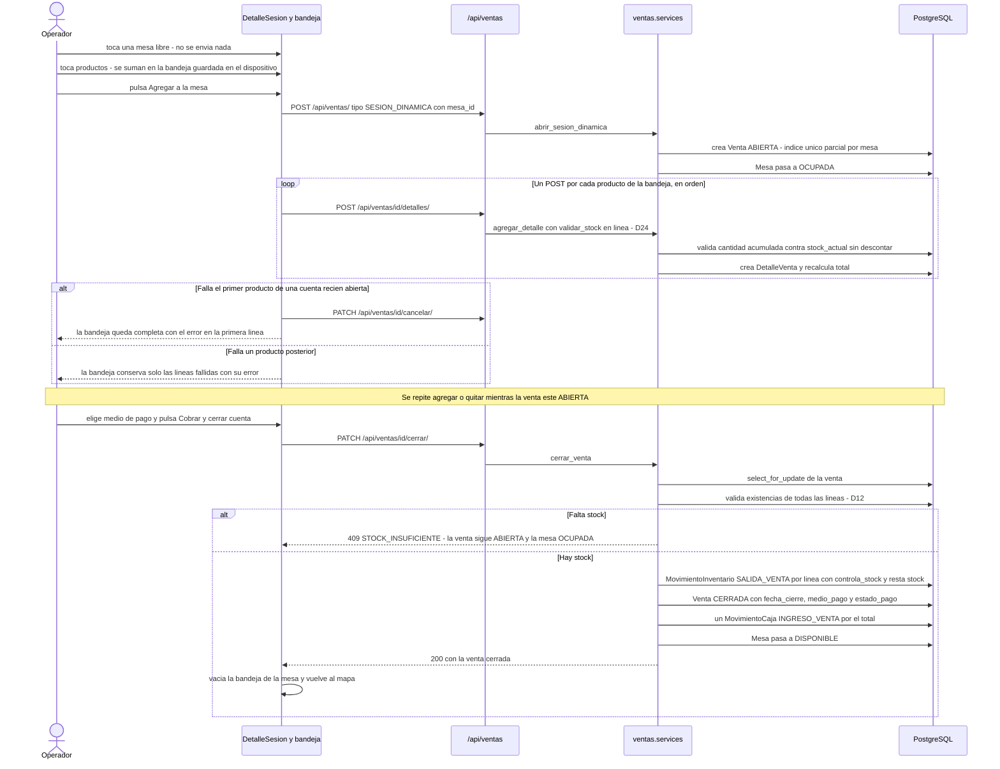

---

## 7. Diagramas de estado

Fuente: `ventas/models.py`, `ventas/services.py`, `servicios/services.py:17-22`, `:116-180`, `finanzas/services.py:69-135`.

### 7.1 Venta

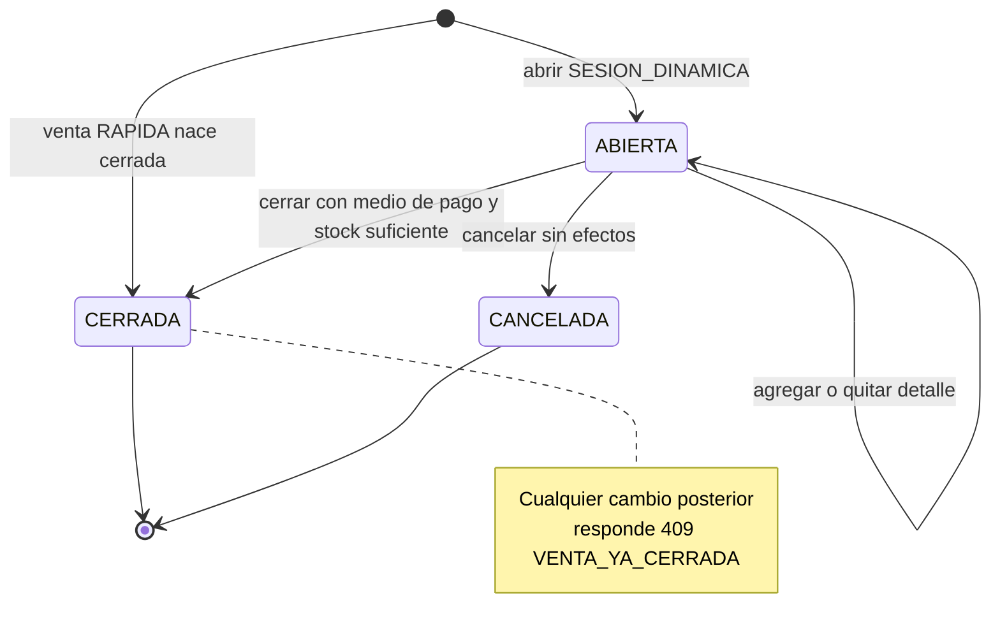

### 7.2 Mesa

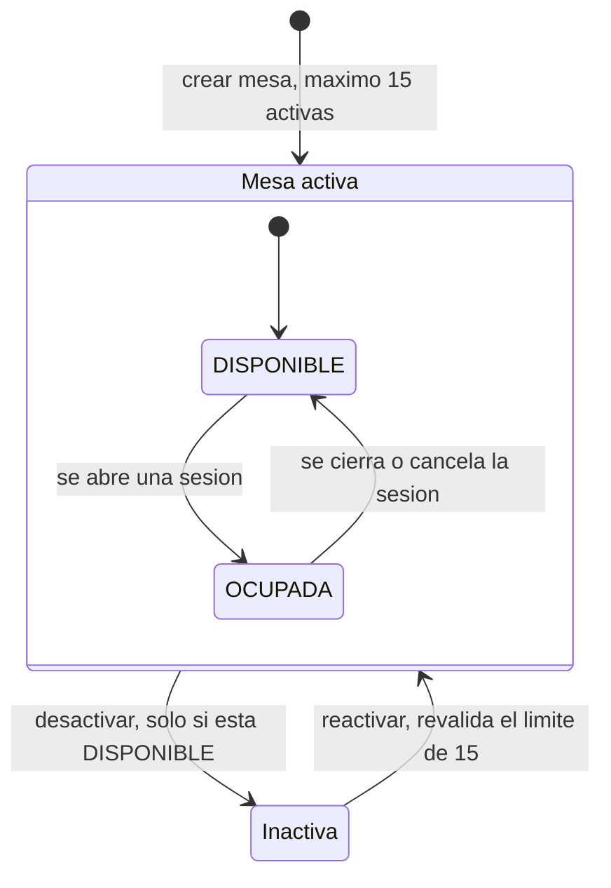

### 7.3 OrdenTrabajo

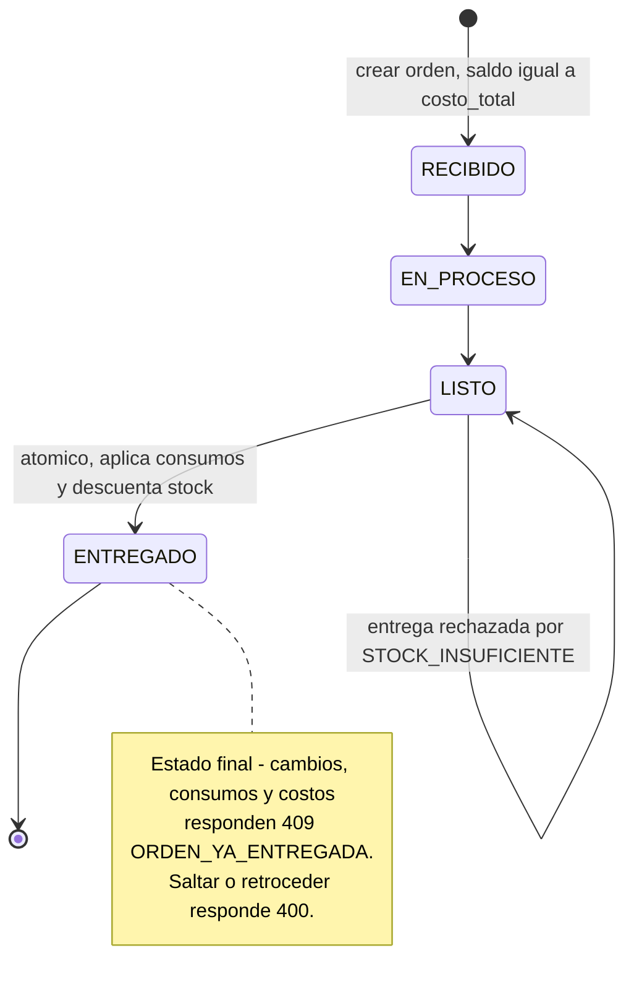

### 7.4 ConsumoOrden

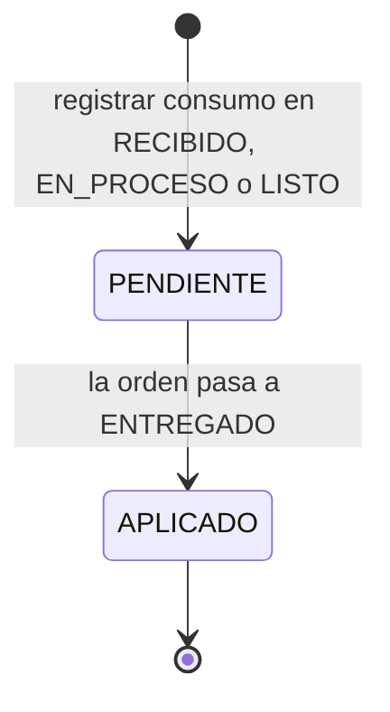

### 7.5 estado_pago (MovimientoCaja, Venta, Abono)

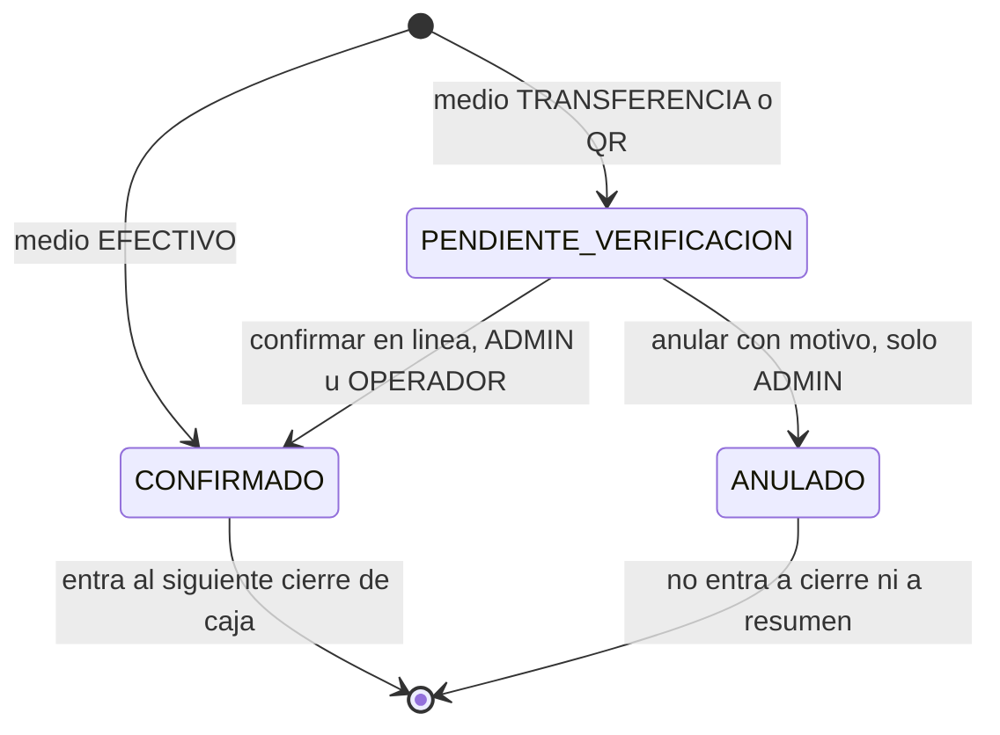

---

## 8. Casos de uso por módulo (actores ADMIN y OPERADOR, según los permisos reales)

Fuente: matriz RBAC de `02b §5.2`.

```mermaid
flowchart LR
    ADM(["ADMIN"])
    OPE(["OPERADOR"])

    subgraph VENTAS["Modulo Ventas"]
        CU01(["CU-01 Venta rapida"])
        CU02(["CU-02 Abrir sesion de mesa"])
        CU03(["CU-03 Consumo en sesion"])
        CU04(["CU-04 Cerrar o cancelar sesion"])
        CU19(["CU-19 Gestionar mesas"])
    end

    subgraph NUCLEO["Nucleo y configuracion"]
        CU05(["CU-05 Catalogo"])
        CU16(["CU-16 Modulos"])
        CU17(["CU-17 Iniciar sesion"])
        CU18(["CU-18 Usuarios"])
        CU21(["CU-21 Dispositivos"])
        CU22(["CU-22 Medios de pago"])
        CU23(["CU-23 Novedades de sincronizacion"])
    end

    subgraph SERVICIOS["Modulo Servicios"]
        CU06(["CU-06 Registrar pedido"])
        CU07(["CU-07 Estado de la orden"])
        CU08(["CU-08 Abono"])
        CU09(["CU-09 Consumo en orden"])
        CU10(["CU-10 Costos y utilidad"])
    end

    subgraph INVENTARIO["Modulo Inventario"]
        CU11(["CU-11 Consultar stock"])
        CU12(["CU-12 Ingreso de mercancia"])
        CU13(["CU-13 Merma y ajuste"])
    end

    subgraph FINANZAS["Modulo Finanzas"]
        CU14(["CU-14 Gasto"])
        CONF(["Confirmar pago pendiente"])
        ANU(["Anular pago pendiente D15"])
        CU15(["CU-15 Cierre de caja"])
        CU20(["CU-20 Resumen diario"])
    end

    OPE --- CU01
    OPE --- CU02
    OPE --- CU03
    OPE --- CU04
    OPE --- CU17
    OPE --- CU23
    OPE --- CU06
    OPE --- CU07
    OPE --- CU08
    OPE --- CU09
    OPE --- CU11
    OPE --- CU12
    OPE --- CU14
    OPE --- CONF

    ADM --- CU01
    ADM --- CU02
    ADM --- CU03
    ADM --- CU04
    ADM --- CU19
    ADM --- CU05
    ADM --- CU16
    ADM --- CU17
    ADM --- CU18
    ADM --- CU21
    ADM --- CU22
    ADM --- CU23
    ADM --- CU06
    ADM --- CU07
    ADM --- CU08
    ADM --- CU09
    ADM --- CU10
    ADM --- CU11
    ADM --- CU12
    ADM --- CU13
    ADM --- CU14
    ADM --- CONF
    ADM --- ANU
    ADM --- CU15
    ADM --- CU20
```

---

## 9. Cierre de sesión por inactividad (D27) — estados del temporizador

Fuente: `frontend/src/contexto/inactividad.ts:7-122`, `frontend/src/componentes/Layout.tsx:41-76`, `frontend/src/contexto/SesionContext.tsx:79-92`.

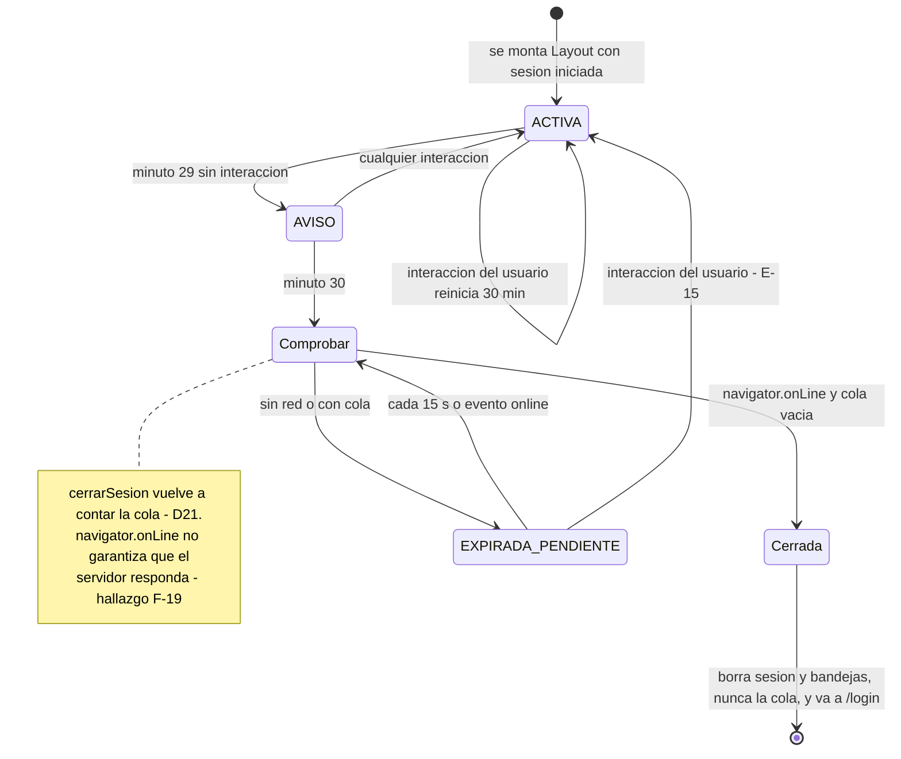

---

## 10. Secuencia del cierre de caja con vista previa (D28)

Fuente: `frontend/src/componentes/PanelCierreCaja.tsx:44-101`, `backend/finanzas/views.py:156-201`, `backend/finanzas/services.py:192-339`.

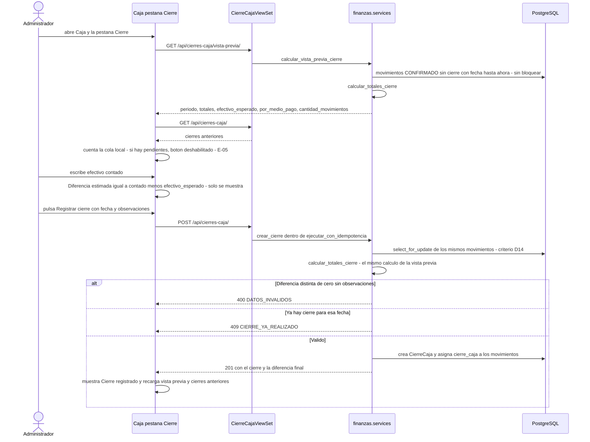

---

## Cambios respecto a la versión del 02/10

- §1 ERD y §3 módulos: sin cambios (no hubo migraciones ni módulos nuevos).
- §2 Despliegue: nota sobre `SECRET_KEY` obligatoria (B1) y el SW que deja pasar `/api/` y `/admin/` (B2).
- §4 Sincronización: el payload de ventas lleva el `precio_unitario` mostrado (D19) y las novedades locales guardan su estado real (B5).
- §5 Venta rápida: la bandeja reemplaza al carrito (E-12) y se vacía al cobrar (E-19).
- §6 rehecho: «Agregar a la mesa» envía un POST por producto, cancela la cuenta si falla el primero y el botón de cobro es «Cobrar y cerrar cuenta».
- §9 nuevo: estados del temporizador de inactividad (D27).
- §10 nuevo: cierre de caja con vista previa y cálculo compartido (D28).
- §7 y §8: sin cambios.
